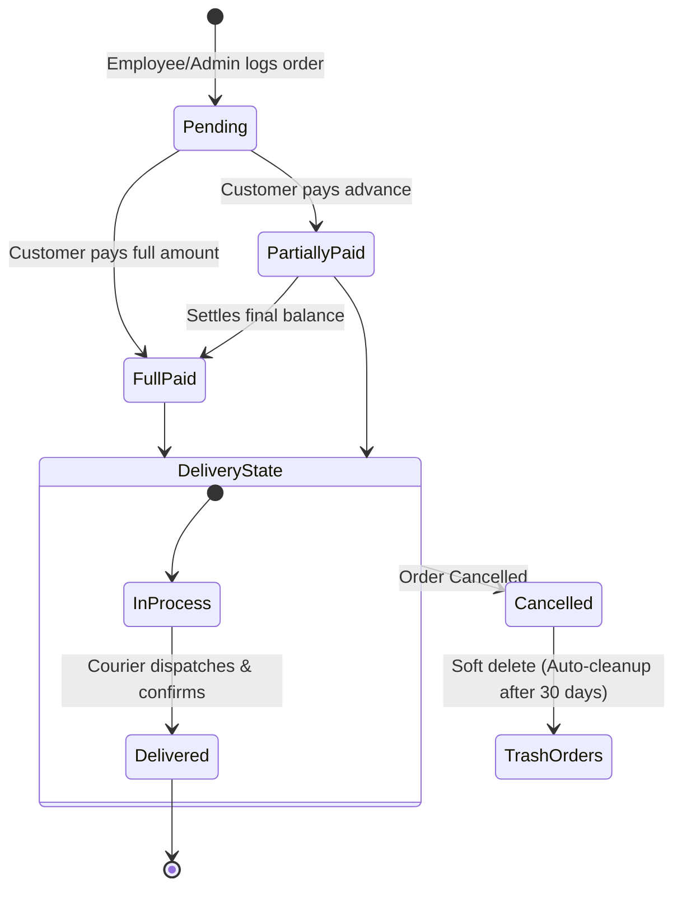
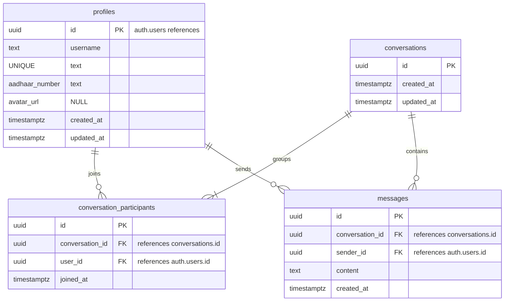
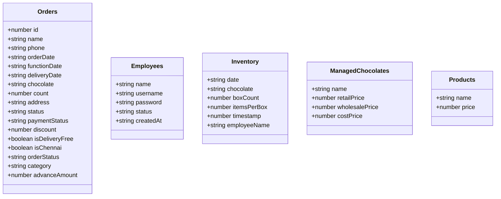

# 🌐 RealConnect Chat & Sabi Return Gifts ERP

[](https://vercel.com)
[](https://vitejs.dev)
[](https://react.dev)
[](https://supabase.com)
[](https://firebase.google.com)
[](https://opensource.org/licenses/MIT)

> **Enterprise-grade unified operations platform bridging identity-verified customer messaging with a robust, real-time inventory and order fulfillment ERP.**

---

## 📋 Table of Contents
1. [Executive Summary](#-executive-summary)
2. [Key Features](#-key-features)
3. [Technology Stack](#-technology-stack)
4. [System Architecture](#-system-architecture)
5. [Feature Modules](#-feature-modules)
6. [User Workflows](#-user-workflows)
7. [Folder Structure](#-folder-structure)
8. [Installation Guide](#-installation-guide)
9. [Environment Variables](#-environment-variables)
10. [Database Schema](#-database-schema)
11. [API Documentation](#-api-documentation)
12. [Authentication & Authorization](#-authentication--authorization)
13. [Security Features](#-security-features)
14. [Performance Optimizations](#-performance-optimizations)
15. [Deployment Guide](#-deployment-guide)
16. [CI/CD](#-cicd)
17. [Testing](#-testing)
18. [Screenshots](#-screenshots)
19. [Roadmap](#-roadmap)
20. [Scalability Considerations](#-scalability-considerations)
21. [Real-World Use Cases](#-real-world-use-cases)
22. [Contributing Guidelines](#-contributing-guidelines)
23. [License & Author](#-license--author)
24. [Project Statistics](#-project-statistics)

---

## 🏢 Executive Summary

### What the Project Does
This repository hosts a unified, multi-tenant hybrid enterprise application. It combines **RealConnect Chat** (a secure, Aadhaar-verified client-to-admin instant messaging system) with **Sabi Return Gifts ERP** (an operations management console handling chocolate/gift catalogs, order workflows, automatic inventory balancing, invoice compilation, and net margin analytics).

### Why It Exists
E-commerce and gift customization services face severe operational bottlenecks:
* **Trust Deficit:** Anonymity in customer inquiries leads to spam orders and fake invoices.
* **Disconnected Systems:** Orders taken in chat tools must be manually keyed into inventory systems.
* **Pricing & Tax Complexities:** Accommodating wholesale vs. retail rates dynamically while calculating margins.
* **Dispersed Communications:** Courier delays, invoice generation, and bank UPI verification occur in separate apps.

### Business Value
* **100% Verified Interactions:** Aadhaar-linked client registration prevents spam and guarantees transaction validity.
* **Integrated Invoicing & Payment:** One-click invoice conversion, dynamic UPI-QR generation, and instant WhatsApp message payload dispatching.
* **Real-time Cost Control:** Prevents selling out-of-stock items through live stock balance logs minus current commitments.

### Technical Value
* **Hybrid Database Strategy:** Employs PostgreSQL (via Supabase) for transactional relational data, strict RLS rules, and chat concurrency, alongside Firebase Firestore for document-oriented order tracking and dynamic catalog configurations.
* **Pixel-Perfect Offline Assets:** Renders client-side invoices using `html2canvas` that download cleanly as images or copy straight to the OS clipboard.

---

## 🚀 Key Features

| Category | Feature Name | Description | Premium Capabilities |
| :--- | :--- | :--- | :--- |
| **Verification** | 🪪 Aadhaar Auth | Enforces a strict 12-digit national ID validation on sign-up. | Integrated registration profile lookup. |
| **Realtime Chat** | 💬 1-on-1 Chat | instant messaging channels powered by Supabase Realtime subscriptions. | Deduplicated contacts, status updates, dark mode. |
| **Order Engine** | 📦 ERP Dashboards | Distinct dashboards for Chocolate orders (Dashboard 1) and Custom Product orders (Dashboard 2). | Mass editing, bulk status transitions, Excel export. |
| **Pricing** | 📊 Multi-tier Pricing | Instant toggle between Retail & Wholesale pricing matrices. | Cost-price calculations stored dynamically. |
| **Invoicing** | 🧾 Auto-Billing | Generates high-fidelity invoices (`OrderInvoiceView`) with automated amount-to-words. | Custom Bank accounts, UPI payment QR, signature watermark. |
| **Inventory** | 📈 Stock Ledger | Real-time box ledger logging (`inventories` ledger) with automatic consumption. | Auto-calculation of items based on box configurations. |
| **Analytics** | 📉 Financial Insights | Secondary passcode-secured reporting screens displaying cost, net profit, and revenue. | Integrated Recharts graphs (Pie, Bar Chart). |
| **Communication** | 📱 WhatsApp Sync | Generates pre-formatted WhatsApp templates with order data & invoices. | Single-click customer messaging hook. |
| **Safety Net** | 🗑️ Recycler Bin | Stores soft-deleted orders in `trash_orders` for 30 days. | Fully automated cutoff cron job cleanup. |

---

## 🛠️ Technology Stack

```
   ┌──────────────────────────────────────────────────────────┐
   │                        FRONTEND                          │
   │   React 18.3 ✦ Vite ✦ TailwindCSS ✦ Radix ✦ TypeScript  │
   └────────────────────────────┬─────────────────────────────┘
                                │
               ┌────────────────┴────────────────┐
               ▼                                 ▼
   ┌───────────────────────┐         ┌───────────────────────┐
   │       DATABASE        │         │    CLOUD & STORAGE    │
   │  Supabase (Postgres)  │         │   Firebase Firestore  │
   │  Realtime Auth/Chat   │         │  Orders & Operations  │
   └───────────────────────┘         └───────────────────────┘
```

* **Frontend Framework:** React v18.3.1 (with TypeScript compiler)
* **Build System:** Vite v5.4.19 (using SWC Compiler for fast HMR)
* **Styling Engine:** TailwindCSS v3.4.17 & CSS Variables (Vanilla Customization)
* **Component Library:** Radix UI primitives (Accordion, Dialog, Tabs, Tooltip, Avatar, Toast)
* **State & Data Fetching:** Tanstack React Query v5 & React Context API
* **Primary Database (Relational/Chat):** Supabase (PostgreSQL 14.4 + Realtime Channels)
* **Secondary Database (Document/ERP):** Google Firebase Firestore v10.8.0
* **Data Visualizations:** Recharts v2.15.4 (Responsive Area, Bar, and Pie Charts)
* **Utility Engines:** `xlsx` (Excel reporting), `html2canvas` (client-side DOM screenshotting)
* **Testing Infrastructure:** Playwright v1.57.0 (End-to-End), Vitest v3.2.4 (Unit/Integration)

---

## 📐 System Architecture

This project leverages a **decoupled hybrid micro-backend** design:
1. **User Space (Customer Client):** Customers authenticate via Supabase Auth. Their profile holds a verified Aadhaar ID. They search other users and write to `messages` inside Postgres.
2. **Operations Space (Admin/Employee Panel):** Admin and staff log into the Sabi ERP dashboard via Firebase authentication (stored locally and validated via Firestore's `employees` collection). They run sales, verify stocks, build invoices, and compute margins.

```mermaid
graph TD
    %% Frontend Subsystem
    subgraph SPA_Vite_Client [SPA Frontend Client]
        App[React App Router]
        AuthCtx[Auth Context Provider]
        ThemeCtx[Theme Context Provider]
        DashPage[ERP Dashboard.tsx]
        ChatPage[Chat.tsx]
        InvView[OrderInvoiceView.tsx]
    end

    %% Database Subsystem 1: PostgreSQL / Supabase
    subgraph Supabase_Backend [Supabase Realtime Cloud]
        SupAuth[Supabase Auth Services]
        PG_DB[(PostgreSQL Database)]
        Profiles[profiles Table]
        Convs[conversations Table]
        Participants[conversation_participants Table]
        Messages[messages Table]
        RealTime[Realtime PubSub Engine]
    end

    %% Database Subsystem 2: Firestore / Firebase
    subgraph Firebase_Backend [Firebase Operations Cloud]
        FS_DB[(Firestore NoSQL)]
        ColOrders[orders Collection]
        ColEmp[employees Collection]
        ColInv[inventory Collection]
        ColChoc[managed_chocolates Collection]
        ColProd[products Collection]
        ColTrash[trash_orders Collection]
    end

    %% External Systems
    subgraph External_Services [Third Party APIs]
        UPI[UPI Merchant Gateway]
        WhatsApp[WhatsApp Web API]
        QRServer[QR Code API Server]
    end

    %% Wiring Connections
    App --> AuthCtx
    App --> ThemeCtx
    AuthCtx -->|Username Lookup & Session| SupAuth
    ChatPage -->|Real-time Sub| RealTime
    RealTime <-->|Sync messages| PG_DB
    PG_DB --> Profiles & Convs & Participants & Messages
    
    DashPage -->|Firestore Client| FS_DB
    FS_DB --> ColOrders & ColEmp & ColInv & ColChoc & ColProd & ColTrash
    
    DashPage --> InvView
    InvView -->|Dynamic Payload| QRServer
    QRServer -->|Embed QR| InvView
    InvView -->|UPI Pay String| UPI
    DashPage -->|Trigger Share| WhatsApp
```



---

## 🧩 Feature Modules

### 1. Identity & Chat Module ([Chat.tsx](file:///c:/Users/aravi/Downloads/realconnect-chat-main/realconnect-chat-main/src/pages/Chat.tsx))
Implements security-first communication. To enter rooms, users register with their Aadhaar Card number.
* **Self-Deduplicated Sidebar:** Queries the Postgres database using joins to fetch only user-associated conversations.
* **Realtime Listener:** Subscribes to Postgres database insertions filtered by `conversation_id`.
* **Database Hooks:** Automatically tracks updates via SQL triggers (`set_profiles_updated_at`).

### 2. Sabi Return Gifts Order Management ([Dashboard.tsx](file:///c:/Users/aravi/Downloads/realconnect-chat-main/realconnect-chat-main/src/pages/Dashboard.tsx))
Supports complex sales workflows:
* **Dual Dashboards:** Dashboard 1 for traditional chocolate variants, and Dashboard 2 for custom items.
* **Pricing Matrices:** Tracks dynamic retail vs. wholesale calculations based on quantities, payment status multiplier scales (Full Paid = 1.0, Partially Paid = 0.5, Pending = 0.0, Cancelled = 0.0).

### 3. Inventory Stock Ledger System
A strict logging system tracks inventory instead of basic counter increments.
* **Balances Computation:** Derived dynamically by querying Firestore collections:
  $$\text{Current Stock} = \sum(\text{Incoming Logged Ledger}) - \sum(\text{Allocated Active Orders})$$
* **Automated Product Cataloging:** Integrates a passcode-protected custom price configuration manager.

### 4. Interactive Financial Analytics Dashboard
Displays margins, revenues, and sales trends:
* **Visual Reports:** Combines Recharts visualizers for quick monthly/yearly financial checks.
* **Protected Audits:** Gated by secondary passcodes (`4567` for standard business reports, `8520` for catalog settings).

### 5. Invoice Generator ([OrderInvoiceView.tsx](file:///c:/Users/aravi/Downloads/realconnect-chat-main/realconnect-chat-main/src/components/OrderInvoiceView.tsx))
Creates high-fidelity client-side billing outputs:
* **UPI Integration:** Dynamically generates custom merchant payment QR codes.
* **Text Localization:** Converts numeric values to words automatically.
* **Exporting Options:** Employs `html2canvas` to copy invoices as images or download them as PNGs.

---

## 🔄 User Workflows

### Registration & Real-time Chat
```mermaid
sequenceStep
    actor Client as Client
    participant UI as Registration Page
    participant SupAuth as Supabase Auth
    participant PG as PostgreSQL (Supabase)
    
    Client->>UI: Input username, password & 12-Digit Aadhaar
    UI->>UI: Validate Aadhaar format (12 numeric digits)
    UI->>SupAuth: Request SignUp (Auto-maps to username@chatapp.local)
    SupAuth-->>UI: Return Auth Success & UID
    UI->>PG: Insert profile row (UID, username, Aadhaar number)
    PG-->>UI: Confirm insertion
    UI->>Client: Redirect to Chat Rooms
```

### Order ERP Lifecycle


---

## 📁 Folder Structure

```lic
realconnect-chat-main/
├── .env                              # Supabase local environment endpoints
├── components.json                   # UI component registry configuration
├── package.json                      # Build scripts, compiler parameters, dependencies
├── tsconfig.json                     # Root TypeScript configuration
├── vite.config.ts                    # Vite pipeline, HMR and alias setups
├── vitest.config.ts                  # Vitest unit testing setup
├── vercel.json                       # Vercel SPA routing and overrides
├── supabase/                         # Supabase backend definitions
│   ├── config.toml                   # Supabase environment metadata
│   └── migrations/                   # SQL migration ledgers and schemas
├── src/                              # Main application codebase
│   ├── main.tsx                      # SPA mount index entry point
│   ├── App.tsx                       # Main application routing and providers
│   ├── index.css                     # Primary Tailwind style declarations
│   ├── components/                   # Reusable components
│   │   ├── OrderInvoiceView.tsx      # Billing generator and exporter
│   │   ├── NavLink.tsx               # Utility navigation components
│   │   ├── chat/                     # Dedicated chat interface assets
│   │   │   ├── ChatWindow.tsx        # Message logs and send inputs
│   │   │   ├── ConversationSidebar.tsx # Contact search and threads
│   │   │   └── EmptyChat.tsx         # Welcome placeholder
│   │   └── ui/                       # Shadcn custom UI components (49 files)
│   ├── contexts/                     # State providers
│   │   ├── AuthContext.tsx           # Session and profiles state provider
│   │   └── ThemeContext.tsx          # Client theme context toggles
│   ├── hooks/                        # Custom React hooks
│   │   ├── use-mobile.tsx            # Viewport monitoring hook
│   │   └── use-toast.ts              # Global toaster notification handler
│   ├── integrations/                 # Third-party integrations
│   │   └── supabase/                 # Supabase configuration & schemas
│   │       ├── client.ts             # Initialized Supabase client
│   │       └── types.ts              # Automatically generated TypeScript types
│   ├── pages/                        # Main page views
│   │   ├── Dashboard.tsx             # Enterprise ERP, Inventory & Analytics
│   │   ├── Index.tsx                 # Fallback/Admin list page
│   │   ├── Chat.tsx                  # Core Chat view
│   │   ├── Login.tsx                 # Supabase login view
│   │   ├── Register.tsx              # Aadhaar-linked signup page
│   │   └── NotFound.tsx              # 404 handler
│   └── test/                         # Test suites
│       ├── setup.ts                  # Testing environment mock configuration
│       └── example.test.ts           # Verification placeholders
└── scratch/                          # Developer testing scripts
    ├── inspect_all.cjs               # Node script to inspect Firestore orders
    └── inspect_db.js                 # Node script to verify Firestore connections
```

---

## 📥 Installation Guide

Follow these steps to set up the project locally:

### Prerequisites
* Ensure you have **Node.js** (v18 or higher) or **Bun** installed.
* Ensure you have a **Firebase Project** and a **Supabase Project** set up.

### Step 1: Clone the Repository
```bash
git clone https://github.com/aravinth081/sabi-returns-gift.git
cd sabi-returns-gift
```

### Step 2: Install Dependencies
Install all required npm packages using Bun or npm:
```bash
# Using npm
npm install

# Using Bun (Recommended)
bun install
```

### Step 3: Configure Environment Variables
Create a `.env` file in the root directory:
```env
VITE_SUPABASE_URL=https://your-supabase-project-id.supabase.co
VITE_SUPABASE_PUBLISHABLE_KEY=your-supabase-publishable-key
```

### Step 4: Run Database Migrations (Supabase)
Apply migrations to your Supabase PostgreSQL database:
```bash
npx supabase migration apply
```

### Step 5: Start the Development Server
```bash
# Using npm
npm run dev

# Using Bun
bun run dev
```
The application will launch on `http://localhost:8080`.

---

## 🔑 Environment Variables

The application uses the following environment variables to authenticate with database providers:

| Variable Name | Required | Description | Example Value |
| :--- | :--- | :--- | :--- |
| `VITE_SUPABASE_URL` | Yes | Endpoint url for Supabase instance. | `https://xpytzmdvfg.supabase.co` |
| `VITE_SUPABASE_PUBLISHABLE_KEY` | Yes | Publishable API key. | `eyJhbGciOiJIUzI1NiIsInR5cCI6IkpXVCJ9...` |

> [!IMPORTANT]
> The internal Firebase config configurations (`apiKey`, `authDomain`, `projectId`, `storageBucket`, `messagingSenderId`, `appId`) are defined directly inside [Dashboard.tsx](file:///c:/Users/aravi/Downloads/realconnect-chat-main/realconnect-chat-main/src/pages/Dashboard.tsx#L25-L32) and [inspect_all.cjs](file:///c:/Users/aravi/Downloads/realconnect-chat-main/realconnect-chat-main/scratch/inspect_all.cjs#L4-L11). To point the ERP dashboard to your custom instance, update these code blocks.

---

## 🗄️ Database Schema

### Relational Database Schema (PostgreSQL via Supabase)
Used for identity verification, profiles, and instant messaging.



### Document Schema (Google Cloud Firestore)
Used for real-time sales transactions, catalogs, inventory ledgers, and employee approvals.



---

## 🔌 API Documentation

### Supabase Database Services (PostgreSQL Client Engine)
Queries are executed directly via the Supabase client:
* **Auth Session Sync:** Checks active JSON Web Tokens (`supabase.auth.getSession()`).
* **Profile Syncing:** Fetches data mapped to the logged-in user ID (`supabase.from("profiles")`).
* **Realtime Realconnect Chat Subscription:** Establishes live websocket channels (`supabase.channel()`).

### Firestore Service Operations (Firestore Client Engine)
Performs NoSQL document-level mutations:
* **Active Orders Query:** Retrieves orders sorted by descending ID (`query(collection(db, "orders"), orderBy("id", "desc"))`).
* **Employee Management:** Registers employees with status set to `Pending` (`addDoc(collection(db, "employees"), employeeData)`).
* **Inventory Balance Tracking:** Reads logs to update available inventory (`onSnapshot(collection(db, "inventory"), callback)`).
* **Auto-Cleanup:** Deletes soft-deleted order backups older than 30 days (`deleteDoc(doc(db, "trash_orders", item.id))`).

---

## 🔐 Authentication & Authorization

```
  [User Enters Application]
              │
              ├──► Client Space  ──► [Supabase Auth] ──► Requires 12-Digit Aadhaar
              │
              └──► ERP Operations ──► [Firestore Employee Database]
                                               │
                                               ├─► Master Admin Passcode (subash g / 561997)
                                               ├─► Staff Access (Approved status required)
                                               ├─► Audits Gate (Passcode: 4567)
                                               └─► Prices Gate (Passcode: 8520)
```

1. **Client Space (Supabase Integration):**
   * Employs standard email/password authentication patterns.
   * On signup, the system requires a valid 12-digit Aadhaar number. It maps user-facing credentials to the domain `${username}@chatapp.local` to simplify login.
2. **ERP Management Space (Firestore Database):**
   * Uses passcodes to manage access.
   * **Master Admin Credentials:** Username: `subash g` | Password: `561997`
   * **Employee Access:** Staff can register accounts which must be approved by the admin.
   * **Secured Feature Gates:** Uses secondary gates (`4567` for financial reporting, `8520` for catalog analytics) to protect business-critical features.

---

## 🛡️ Security Features

* **Row Level Security (RLS):** Supabase database tables restrict data access. Postgres policies permit users to view only their own profiles, messages, and associated conversations.
* **Passcode-Protected Features:** Gated access protects catalog prices and financials.
* **Automatic Data Deletion:** Cleans up soft-deleted orders after 30 days to save space.
* **Input Validation:** Zod and custom regex engines validate phone formats, Aadhaar numbers (12-digit format), and currency values.

---

## ⚡ Performance Optimizations

* **Tanstack Query Caching:** Leverages React Query cache for server state, avoiding redundant network requests.
* **Automated Component Tagging:** Integrates `lovable-tagger` to monitor and trace React components.
* **Selective Rendering:** Optimizes heavy calculations (like sales summaries) using `useMemo`.
* **Debounced Search Queries:** Implements a 300ms debounce on user searches to prevent database overload.
* **Indexed Queries:** Optimizes database queries by indexing fields like `orderDate` and `deliveryDate`.

---

## 🚢 Deployment Guide

The project is pre-configured for deployment to **Vercel** as a single-page application:

### Quick Vercel Setup
1. **Initialize Project:** Create a new project on Vercel and link it to your GitHub repository.
2. **Configure Settings:**
   * **Build Command:** `npm run build` or `vite build`
   * **Output Directory:** `dist`
   * **Framework Preset:** `Vite`
3. **Set Environment Variables:** Add your `VITE_SUPABASE_URL` and `VITE_SUPABASE_PUBLISHABLE_KEY` variables.
4. **Deploy:** Vercel automatically deploys the application and routes requests using `vercel.json`.

---

## 🔄 CI/CD

While the project does not include custom workflow files, you can easily integrate standard CI pipelines:
* **Vercel Integration:** Hook your GitHub repository directly to Vercel for automated deployments.
* **PR Testing Workflow:** Set up a GitHub Actions workflow to run linting and tests before merging:
```yaml
name: CI Suite
on: [push, pull_request]
jobs:
  validate:
    runs-on: ubuntu-latest
    steps:
      - uses: actions/checkout@v4
      - uses: actions/setup-node@v4
        with:
          node-version: 20
      - run: npm ci
      - run: npm run lint
      - run: npm run test
```

---

## 🧪 Testing

The codebase includes configurations for unit, integration, and E2E testing.

### E2E Testing with Playwright
Playwright is configured to test core user flows. Run the E2E test suite using the following commands:
```bash
# Install browsers
npx playwright install

# Run tests
npx playwright test
```

### Unit Testing with Vitest
Vitest runs unit tests in a simulated browser environment. Run the unit test suite using the following commands:
```bash
# Run tests once
npm run test

# Run tests in watch mode
npm run test:watch
```

---

## 🖼️ Screenshots

Use the placeholders below to insert screenshots of the application:

### Verified Chat Room (RealConnect)
``
*Description: Displays the secure chat room interface with user status indicators and the dark theme enabled.*

### ERP Dashboard (Sabi Return Gifts)
``
*Description: Displays the primary dashboard with order tables, pricing selectors, and delivery filters.*

### Invoice Generator & Payment QR
``
*Description: Shows the generated invoice complete with HDFC bank details, payment status, and UPI QR code.*

---

## 🗺️ Roadmap

- [ ] **Aadhaar Verification Integration:** Integrate with a national ID API (e.g., UIDAI sandboxes) to replace manual checks with automated Aadhaar card verification.
- [ ] **Automated Courier Integration:** Integrate with local courier APIs (e.g., Delhivery, Dunzo) to automatically generate tracking links for orders marked `Delivered`.
- [ ] **Multi-Currency Support:** Add multi-currency support to accommodate international orders.
- [ ] **PDF Generator Engine:** Add server-side PDF generation to email copies of invoices directly to customers.
- [ ] **Push Notifications:** Implement push notifications using Firebase Cloud Messaging to notify users of status changes.

---

## 📈 Scalability Considerations

* **Decoupled Databases:** Using Supabase for chat and Firestore for orders ensures both services can scale independently.
* **Serverless Architecture:** Deploying the frontend to Vercel and leveraging serverless database backends allows the application to handle traffic spikes effortlessly.
* **Component-Driven UI:** The modular UI architecture simplifies updates and makes it easy to introduce new features.

---

## 💼 Real-World Use Cases

* **Local Return Gift Distributors:** Simplifies order management, wholesale pricing, and invoicing for gift businesses.
* **E-Commerce Platforms:** An ideal template for businesses looking to build a secure, chat-driven sales platform.
* **Inventory & Order Management systems:** Useful for small-to-medium businesses requiring a unified portal to track stock and sales records.

---

## 🤝 Contributing Guidelines

We welcome contributions to this project! To contribute:
1. **Fork the Repository:** Create a copy of the repository in your GitHub account.
2. **Create a Feature Branch:** `git checkout -b feature/your-feature-name`
3. **Commit Your Changes:** Write descriptive commit messages.
4. **Push Your Branch:** `git push origin feature/your-feature-name`
5. **Open a Pull Request:** Describe your changes in detail and request a review.

Please ensure your code formatting aligns with the project's Prettier and ESLint rules.

---

## 📄 License & Author

* **License:** Distributed under the MIT License. See `LICENSE` for details.
* **Owner & Lead Developer:** [Subash G](mailto:sabireturngifts@gmail.com)
* **Lead Architect:** [Aravinth](https://github.com/aravinth081)
* **Contributions & Support:** For inquiries, contact the team at [sabireturngifts@gmail.com](mailto:sabireturngifts@gmail.com).

---

## 📊 Project Statistics

* **Main Modules:** 2 (RealConnect Chat Client & Sabi Return Gifts ERP System)
* **Pages:** 6 (Dashboard, Chat, Index, Login, Register, NotFound)
* **Reusable UI Components:** 52
* **Database Tables/Collections:** 11 (4 PostgreSQL Tables, 7 Firestore Collections)
* **External APIs:** 3 (UPI Pay, WhatsApp Web API, QRServer API)

---

<div align="center">
  <h3>Sabi Return Gifts ERP &copy; 2026. All rights reserved.</h3>
  <p>Providing secure, real-time logistics and billing systems.</p>
</div>
