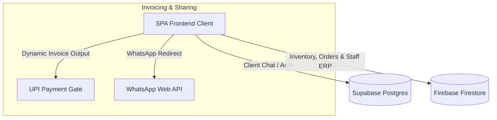

# 📦 SabiSales ERP

[](https://vitejs.dev)
[](https://react.dev)
[](https://supabase.com)
[](https://firebase.google.com)
[](https://opensource.org/licenses/MIT)

A modern, high-performance operations platform built for **Sabi Return Gifts**. It connects a real-time client communication portal with an internal staff dashboard to handle inventory tracking, wholesale/retail order pricing, and automated UPI billing.

---

## 🚀 Key Features

* **Dual Operations Hub:**
  * **Dashboard 1 (Chocolates):** Manages chocolate variant orders, Chennai delivery filters, and quantities.
  * **Dashboard 2 (Products):** Manages custom gift catalog items and pricing.
* **Smart Invoicing:** Automated billing component (`OrderInvoiceView`) featuring automatic numbers-to-words translation, custom bank info, signature watermarks, and dynamically generated UPI payment QR codes.
* **Dynamic Inventory Balance:** Computes real-time stock balances on-the-fly by subtracting active sales commitments from raw stock supply logs.
* **Instant Sharing:** Generates ready-to-send WhatsApp templates containing complete order totals and invoice attachments.
* **Recycler Bin:** Protects against accidental deletion by holding canceled orders in `trash_orders` for 30 days before permanent deletion.
* **Financial Analytics:** Secondary passcode-protected visuals displaying total costs, gross revenues, and net profit margins.

---

## 🛠️ Technology Stack

* **Frontend:** React 18.3, Vite, TypeScript, TailwindCSS, Radix UI Primitives, Lucide Icons.
* **State Management:** Tanstack React Query v5 & React Context API.
* **Client Database (Real-time Messaging):** Supabase (PostgreSQL 14.4 + Realtime Channels).
* **Internal Database (ERP & Catalog):** Google Firebase Firestore.
* **Data Visualization:** Recharts (Dynamic bar & pie reports).
* **Export Utilities:** `xlsx` (Excel ledger exports) & `html2canvas` (Invoice image generator).

---

## 🔒 Authentication & Role System

The app utilizes a dual authentication model:

1. **Client Space (Supabase Portal):**
   * Secure registration and login flow for customers.
   * Leverages Supabase Realtime for secure, client-to-employee messaging rooms.
2. **Staff ERP Dashboard (Firebase/Firestore):**
   * **Master Admin Logins:** Access using Username: `subash g` | Password: `561997`.
   * **Employee Request Access Flow:** Employees register their details on the portal, which creates an account with `Pending` status in the database. The Master Admin approves them via the admin console to unlock access.
   * **Passcode Gates:** Analytics pages are locked behind passcodes (`4567` for financial reporting, `8520` for custom product catalogs).

---

## 📁 System Architecture



---

## ⚙️ Environment Configuration

Create a `.env` file in the root directory to store Supabase configuration:

```env
VITE_SUPABASE_URL=https://your-project-id.supabase.co
VITE_SUPABASE_PUBLISHABLE_KEY=your-publishable-key
```

*Note: The Firebase client configuration credentials for the sales operations database are hosted directly inside `Dashboard.tsx`.*

---

## 📦 Installation & Setup

### Prerequisites
* Node.js (v18+) or Bun installed.

### Steps
1. Clone the project and navigate to the directory:
   ```bash
   git clone https://github.com/aravinth081/sabi-returns-gift.git
   cd sabi-returns-gift
   ```
2. Install npm dependencies:
   ```bash
   # Using npm
   npm install

   # Using Bun
   bun install
   ```
3. Boot the local development server:
   ```bash
   npm run dev
   ```
4. Access the portal at `http://localhost:8080`.

---

## 🧪 Testing

* **Unit Testing:** Run `npm run test` (Vitest engine).
* **End-to-End Testing:** Run `npx playwright test` to test UI inputs and paths.

---

## 📄 License
This project is licensed under the MIT License - see the LICENSE file for details.
